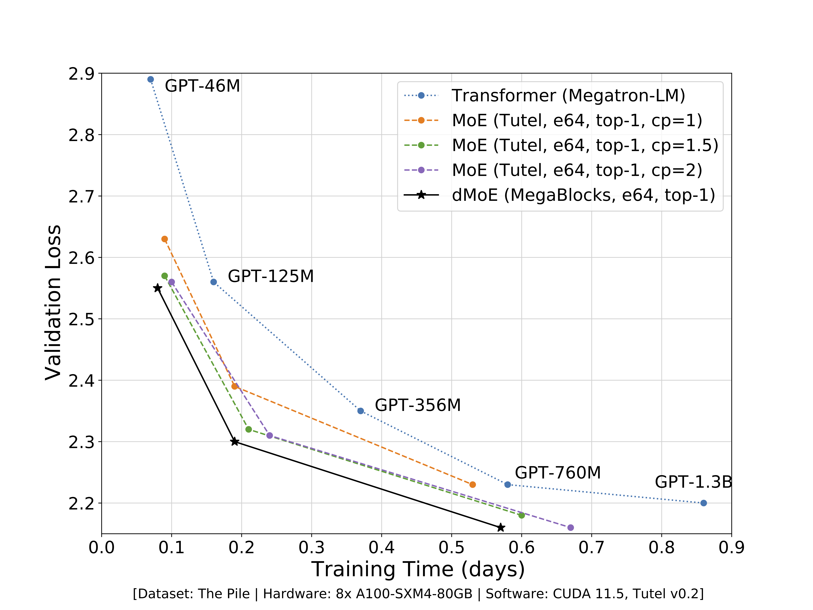

# :robot: MegaBlocks

MegaBlocks is a light-weight library for mixture-of-experts (MoE) training. The core of the system is efficient "dropless-MoE" ([dMoE](megablocks/layers/dmoe.py), [paper](https://arxiv.org/abs/2211.15841)) and standard [MoE](megablocks/layers/moe.py) layers.

MegaBlocks is built on top of [Megatron-LM](https://github.com/NVIDIA/Megatron-LM), where we support data, expert and pipeline parallel training of MoEs. We're working on extending more frameworks to support MegaBlocks.

# :rocket: Performance



MegaBlocks dMoEs outperform MoEs trained with [Tutel](https://github.com/microsoft/tutel) by up to **40%** compared to Tutel's best performing `capacity_factor` configuration. MegaBlocks dMoEs use a reformulation of MoEs in terms of block-sparse operations, which allows us to avoid token dropping without sacrificing hardware efficiency. In addition to being faster, MegaBlocks simplifies MoE training by removing the `capacity_factor` hyperparameter altogether. Compared to dense Transformers trained with [Megatron-LM](https://github.com/NVIDIA/Megatron-LM), MegaBlocks dMoEs can accelerate training by as much as **2.4x**. Check out our [paper](https://arxiv.org/abs/2211.15841) for more details!

# :building_construction: Installation

NOTE: This assumes you have `numpy` and `torch` installed.

**Training models with Megatron-LM:** We recommend using NGC's [`nvcr.io/nvidia/pytorch:23.09-py3`](https://catalog.ngc.nvidia.com/orgs/nvidia/containers/pytorch/tags) PyTorch container. The [Dockerfile](Dockerfile) builds on this image with additional dependencies. To build the image, run `docker build . -t megablocks-dev` and then `bash docker.sh` to launch the container. Once inside the container, install MegaBlocks with `pip install .`. See [Usage](#steam_locomotive-usage) for instructions on training MoEs with MegaBlocks + Megatron-LM.

**Using MegaBlocks in other packages:** To install the MegaBlocks package for use in other frameworks, run `pip install megablocks`. For example, [Mixtral-8x7B](https://mistral.ai/news/mixtral-of-experts/) can be run with [vLLM](https://github.com/vllm-project/vllm) + MegaBlocks with this installation method.

**Extras:** MegaBlocks has optional dependencies that enable additional features.

Installing `megablocks[quant]` enables configurable quantization of saved activations in the dMoE layer to save memory during training. The degree of quantization is controlled via the `quantize_inputs_num_bits`, `quantize_rematerialize_num_bits` and `quantize_scatter_num_bits` [arguments](https://github.com/stanford-futuredata/megablocks/blob/main/megablocks/layers/arguments.py).

Installing `megablocks[gg]` enables dMoE computation with grouped GEMM. This feature is enabled by setting the `mlp_impl` argument to `grouped`. This is currently our recommended path for Hopper-generation GPUs.

MegaBlocks can be installed with all dependencies via the `megablocks[all]` package.

# :steam_locomotive: Usage

We provide scripts for pre-training Transformer MoE and dMoE language models under the [top-level directory](megablocks/). The quickest way to get started is to use one of the [experiment launch scripts](exp/). These scripts require a dataset in Megatron-LM's format, which can be created by following their [instructions](https://github.com/NVIDIA/Megatron-LM#data-preprocessing).

# :writing_hand: Citation

```
@article{megablocks,
  title={{MegaBlocks: Efficient Sparse Training with Mixture-of-Experts}},
  author={Trevor Gale and Deepak Narayanan and Cliff Young and Matei Zaharia},
  journal={Proceedings of Machine Learning and Systems},
  volume={5},
  year={2023}
}
```
